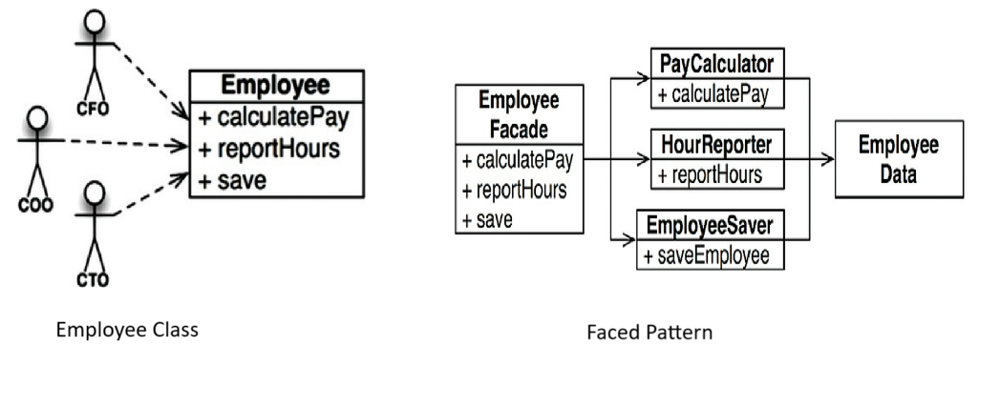

# SOLID PRINCIPLES

1. The Single responsibility Principle
2. The Open Closed Principle
3. The Liskov Substitution Principle 
4. The interface Seggregation Principle 
5. The Dependency Inversion Principle 

# Single Responsibility Principle 

*A module should have one , and only one, reason to change.* 

*A module should be responsible to one , and only one, user or stackeholder*

**A module should be responsible to one , and only one,actor.**

# The Open Closed Principle

**A software artifact should be open for extension but closed for modufication**

    The goal of this principle is to make the system easy to extend without incurring a high impact of change.This goal is accumplished by patitioning the system in to components and arranging components in a dependency hierarchy, that protects higher level components from changes in the lower level component.